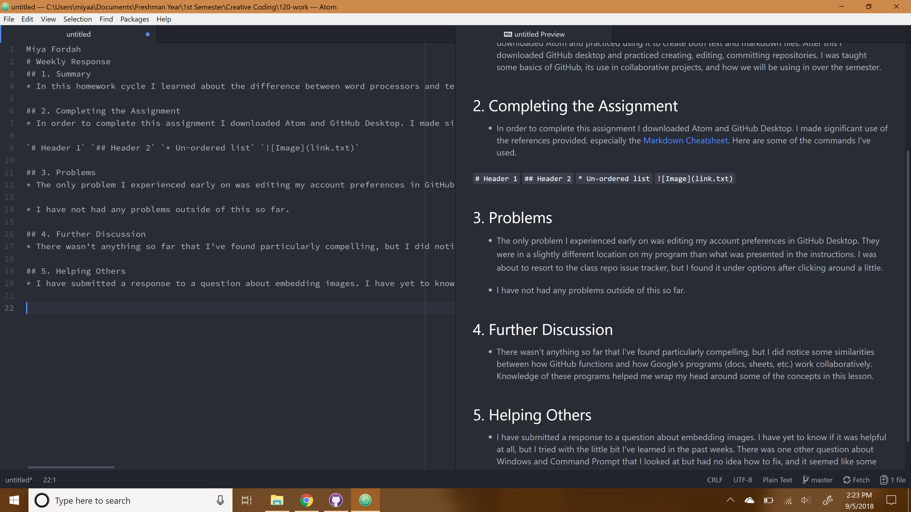

Miya Fordah
# Weekly Response
## 1. Summary
* In this homework cycle I learned about the difference between word processors and text editors. I then downloaded Atom and practiced using it to create both text and markdown files. After this I downloaded GitHub desktop and practiced creating, editing, committing repositories. I was taught some basics of GitHub, its use in collaborative projects, and how we will be using in over the semester.

## 2. Completing the Assignment
* In order to complete this assignment I downloaded Atom and GitHub Desktop. I made significant use of the references provided, especially the [Markdown Cheatsheet](https://github.com/adam-p/markdown-here/wiki/Markdown-Cheatsheet#images). Here are some of the commands I've used.

`# Header 1` `## Header 2` `* Un-ordered list` ``

## 3. Problems
* The only problem I experienced early on was editing my account preferences in GitHub Desktop. They were in a slightly different location on my program than what was presented in the instructions. I was about to resort to the class repo issue tracker, but I found it under options after clicking around a little.

* I have not had any problems outside of this so far.

## 4. Further Discussion
* There wasn't anything so far that I've found particularly compelling, but I did notice some similarities between how GitHub functions and how Google's programs (docs, sheets, etc.) work collaboratively. Knowledge of these programs helped me wrap my head around some of the concepts in this lesson.

## 5. Helping Others
* I have submitted a response to a question about embedding images. I have yet to know if it was helpful at all, but I tried with the little bit I've learned in the past weeks. There was one other question about Windows and Command Prompt that I looked at but had no idea how to fix, and it seemed like some other people had it covered.

# Markdown Image

