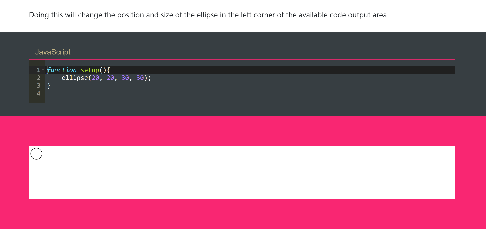

Miya Fordah

["Hello World!" Sketch](https://mafordah.github.io/120-work/hw-3/)

# Summary
This homework cycle I learned how to create a "Hello World!" sketch in p5.js including:
* text
* shapes
* canvas size
* background color

I also learned how to add comments and basically use them to nullify lines of code. From there I got an idea about the index.html file works and how it acts with the sketch.js and the p5 library to create the webpage.

I chose to create an orange canvas with the "Hello World!" text somewhat centered on it. I chose orange simply because it's my favorite color, and I tried my best to center it because I looked nicer to me. I learned some basic p5 commands as well as why p5 was created and where to find additional commands should I need them.

It was great to move into making something other than words. I felt a bit like a wizard when the first circle appeared on the screen. There's so much I'm excited to learn how to do.

# My Steps

In order to complete this assignment I had to learn new commands. I also had to familiarize myself with how they work. I started with

```
fuction setup(){
  text("Hello World", 0, 10);
  }
```

The setup function is required for the sketch to run. The text function the formed the "Hello World!" text and defined where it should go in x and y coordinates. From there I learn how to create an ellipse as part of my "Hello World".

```
function setup(){
  ellipse(20, 20, 30, 30)
}
```
The added ellipse function defines the width and height and x and y coordinates of an ellipse.

Then I added the draw function which draws parts of the sketch, the createCanvas function which determines the size of the canvas, and the background fuction that defines the color of the background.

```
function setup(){
  createCanvas(800,500)
  background('orange')
}

function draw(){
  text("Hello World!!", 380, 250)
}

```

# Problems

I didn't have any problems with the actual code, but did notice that on the class github website I can't see the tabs to view the html and the JavaScript separately from the sketch output. It didn't seem like a significant problem, because I can still edit the code so I didn't post to the repo. I also thought it might be a discrepancy between the video and the actual site so I wasn't worried about it. This is what I am seeing:



Other than that, everything went smoothly.

# Further Discussion

I'm curious if there is a function to actually center things on the canvas or to center the canvas itself. I'm sure there is, and I can't wait to learn it. After being pampered with Adobe programs, it hurts a little to see everything off to the side.

Also, I was very surprised the `background` fuction accepted actual color names. I was expecting it to only take RGB code or hexadecimal notation. Just being able to type a simple color name makes p5.js seem far more user friendly than I thought it would be. I'm also curious how you'd change the color of text. I was trying things and `color` didn't work but I'm sure, if I took the time to look at commands, it's easier than I think it is too.

# Helping Others

I wasn't able to find many issues that weren't either resolved before I got to them or way over my head. There are definitely lots of people that are above me on the learning curve for sure. I did add more information to an issue about opening the directory in Atom and the different ways to do it, but someone before me had probably answered the question enough already. I'm not very good at coding myself, but it's nice to add information I do know when I can.

###### All and all I'm excited to continue learning p5.js and add more to my sketch creating abilities.
